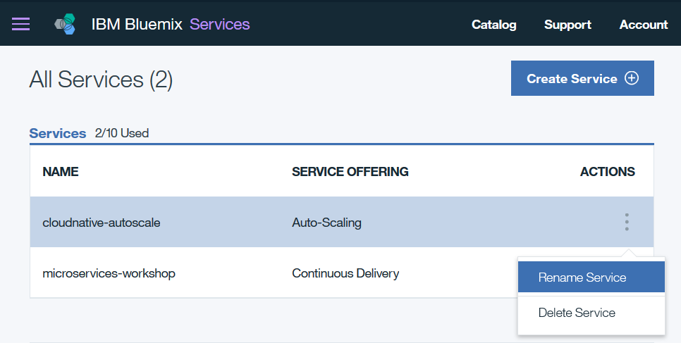
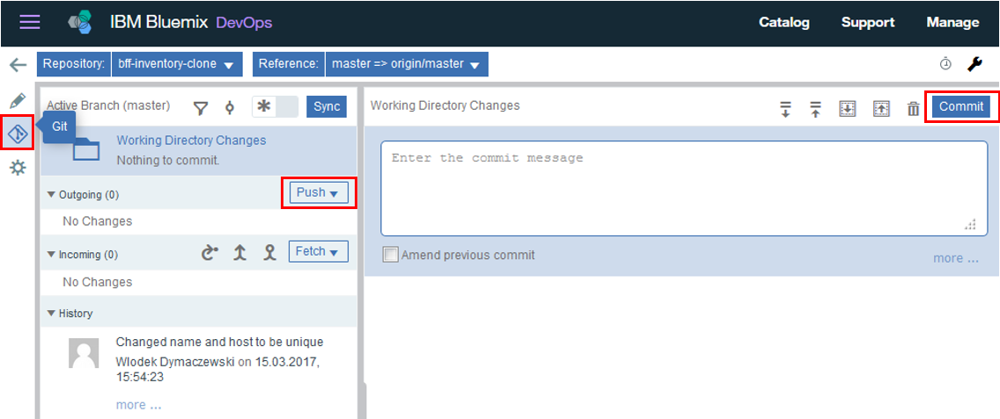

# Deploying Inventory BFF Cloud Foundry Application

In this unit, you will be configuring and deploying the inventory Backend for Frontend (BFF) application. This application acts as a front-end proxy for the actual inventory microservice application that you just deployed. Backend for Frontend (BFF) applications are typically implemented as placeholders while the actual back-end applications are being developed. They can be used to validate any functions in the front-end application before the back-end is ready. Eventually, when the back-end application is ready,  the front-end can be used as a service proxy or another abstraction layer. The steps here are based on `https://github.com/ibm-cloud-architecture/refarch-cloudnative-bff-inventory`.

## Exercise 1: Exploring the Inventory BFF application

As opposed to the Inventory microservice application that was written in Java and deployed in a container, this application is written in Node.js and is deployed as a Cloud Foundry application. It acts as a proxy between frontend web and mobile applications and the Inventory microservice.

Follow these instructions to explore and configure the Inventory BFF application.

1. First, let's explore how the BFF application works. The main module resides in the `routes/itemservices.js` file [in this source code repository](https://github.com/dymaczew/bff-inventory). This file defines the route to the Inventory microservice application, and contains the logic of the REST API calls for the various types of requests that can be sent to that application. 

   The `microserviceBaseUrl` variable points to Zuul proxy - a component which will ask Eureka for location of `inventory-microservice` instances and will pass the request to one of them.

        var microserviceBaseUrl = "https://netflix-zuul-dymaczew.mybluemix.net/inventory-microservice/micro";

   The content of each `app.<method>` call code block first completes the HTTP URL for the REST call operation and the corresponding function defines the processing it performs.

2. The Bluemix application definition resides in [manifest.yml](https://github.com/dymaczew/bff-inventory/blob/master/manifest.yml). This contains the parameters that will control the deployment of the application to Cloud Foundry. In this file, the important definitions are:

   - name: application name - `inventory-bff-app`
   - host: application route hostname - `inventory-bff-app`
   - services: attached autoscale service - `cloudnative-autoscale`

   The `cloudnative-autoscale` definition refers to a Bluemix autoscaling service that you have not created yet. You will create it in the next exercise. This definition is instructing Cloud Foundry to bind the Inventory BFF application to this service when it is deployed.

## Exercise 2: Deploying the Inventory BFF Application to Bluemix Cloud Foundry

Since you have already have a delivery toolchain from previous exercise, adding another microservice is easy:

1. Open your toolchain (Menu --> Services --> DevOps --> Toolchains --> \<Your toolchain from previous Lab\>)
2. Click `Add a tool` and select Github
3. Provide the following information:  
        Repository type: Clone  
        Provide new name e.g. bff-inventory-\<username\>  
        Provide source URL https://github.com/dymaczew/bff-inventory.git  
4. Click "Create Integration"

5. Click `Add a tool` again and select `Delivery Pipeline`
6. Provide the Pipeline name (for example the same as above bff-inventory-\<username\>) and click "Create Integration"
7. Click on Delivery Pipeline with your name, then click "Add stage"
8. Change the name from MyStage to Deploy. Since the service is written in JavaScript there is no need for build/compile stage
9. Verify that Input is pointing to your clone of repository. Click the `Jobs` tab and `Add Job`. Accept default values and click "Save"
**DO NOT RUN the stage yet (If will fail)**

10. Go to Bluemix Services Catalog, select DevOps and add new service of type "Auto Scale". Name of the service will be autogenerated, change it to `cloudnative-autoscale`

11. Get back to your toolchain view and add another tool: `Eclipse Orion Web IDE`
12. Open the Eclipse Orion Web IDE after adding - select `manifest.yml` from `bff-inventory-<username>` project and change `name` and `host` lines to be unique (for example by adding -\<username\> to them)
13. Click on the Git icon, provide commit message and click `Commit`, than click `Push`

Your delivery pipeline will detect change in the source code repository and will automatically trigger the deployment of the application. You can verify that clicking on the `View logs and history` in the Delivery Pipeline view 

14. After the deployment has completed, test the Inventory BFF application. You can use some of the functions defined in `routes/itemservices.js` to verify the setup. Open a Web browser and use the following URLs:
   - `http://inventory-bff-app-<username>.mybluemix.net/api/items/validate`
   - `http://inventory-bff-app-<username>.mybluemix.net/api/items/13401`
   - `http://inventory-bff-app-<username>.mybluemix.net/api/image/collator.jpg`
 
