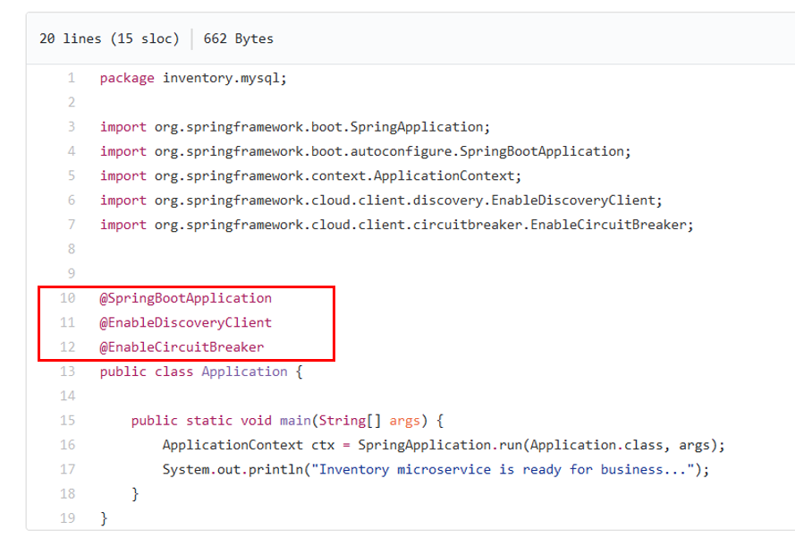
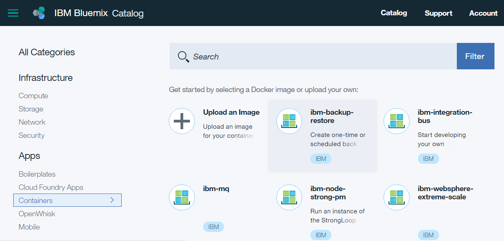
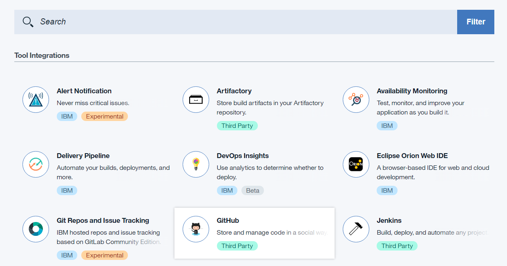
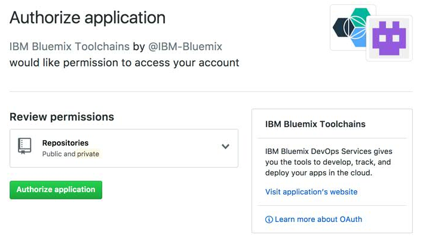
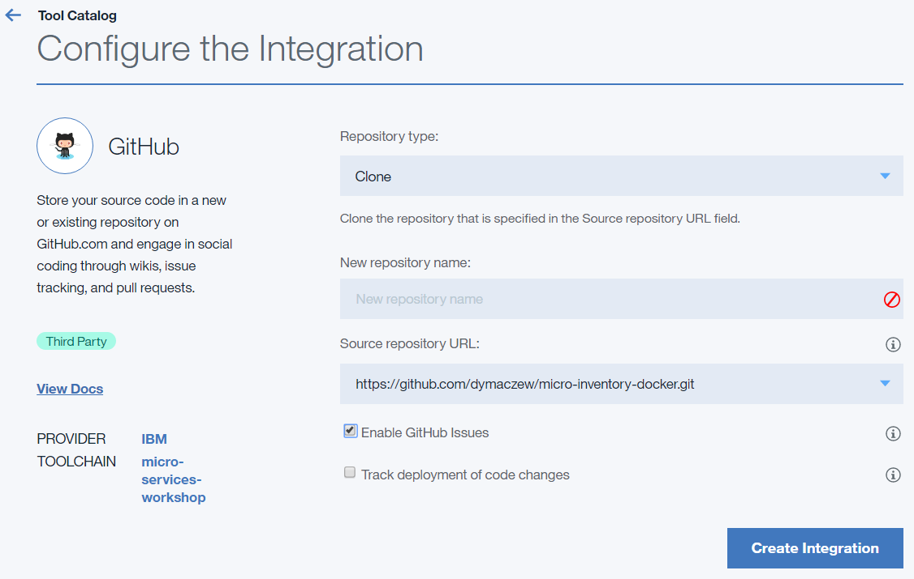
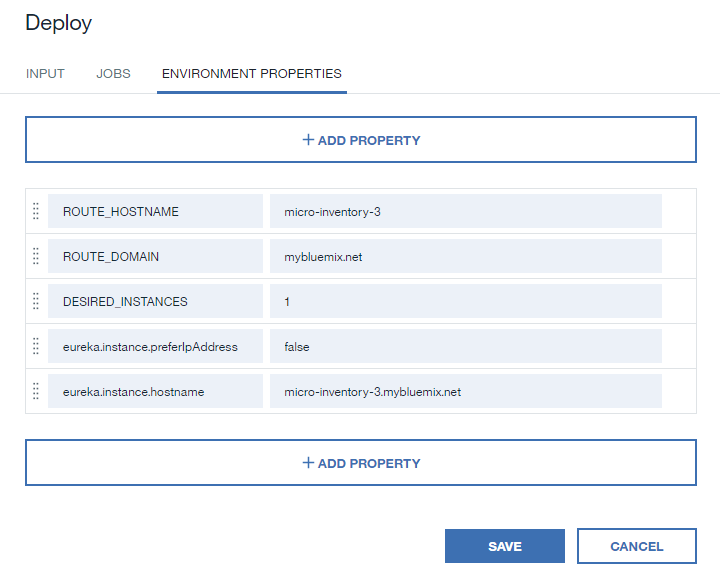
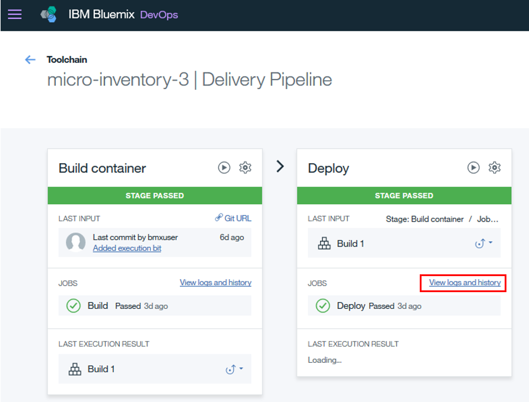
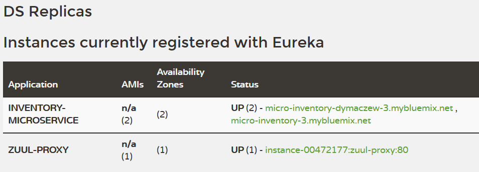

# Deploying microservice for database integration

In the first exerices you will deploy microservice written in Java with [Spring Cloud framework](http://projects.spring.io/spring-cloud/)  
The microservice exposes data from the database over HTTP (translates HTTP GET request into proper SQL query and returns data)  

MySQL database was already provisioned for you and it is available under 169.46.17.190  
Inside the database, there is a sample inventory db that contains tables with information about 'items'.

Microservices can be developed using different programing languages and can run on almost any platform. In this example we will use the microservice written in Java running in Docker container.

IBM Bluemix is the only public cloud that provides you with choice of 5 different target platforms. You can run your workload as:
- bare metal servers
- virtual machines
- Docker containers
- Cloud Foundry applications
- OpenWhisk event-driven workflows

## Examining source code
Take a look at the application source code  
1. Open the file [Application.java](https://github.com/dymaczew/cloudnative-micro-inventory-dymaczew/blob/master/src/main/java/inventory/mysql/Application.java). You will notice the following lines:  

The lines marked in red are responsible for initiating the Spring Cloud framework in the application, registering the microservice in Eureka registry and enabling circuit breaker (Hystrix)

2. Open the configuration file for Spring Cloud framework [here](https://github.com/dymaczew/cloudnative-micro-inventory-dymaczew/blob/master/src/main/resources/application.yml)  
The file contains externalized variables used by the framework - such as location of Eureka service or database to which application should connect.  
The values from the file can be overridden with environment variables at the runtime.

For you convenience application is already compiled and you will use git repository containing app.jar as well as corresponding Dockerfile [here](https://github.com/dymaczew/micro-inventory-docker.git)

Dockerfile is an instruction for Docker how to build a container image. You can view the content of the Dockerfile for the lab [here](https://github.com/dymaczew/micro-inventory-docker/blob/master/Dockerfile)

## Deploying Docker container
To start deploying Docker containers in Bluemix you have to create a namespace in docker registry hosted on Bluemix. This namespace will identify your images and containers

  1. Login to Bluemix console
  2. Click "Catalog" in the top right part of the screen. Then select "Containers" under Apps menu on the left. Try to create any new container clicking on the name (for example "ibm-backup-restore").  

  

  3. A "Set registry namespace" dialog pops up. Provide a name of your choice and click "Save". When the namespace is created, you can go back to the dashboard and continue with the exercise

### Setting up Continuous Delivery service

Now you will define DevOps service - a process that automates building and deploying your microservices whenever source code is changed.
1. From the top left menu select "Service" and "DevOps". Then click "Create DevOps Service" button.
2. Select "Continuous Delivery" service from available services. Review payment plan (Should be 'Free') and click 'Create'.
3. On the "Get started with Continuous Delivery" select "Start from a toolchain template". Scroll down and then select "Build your own toolchain" in "Other toolchains" category. Provide the name for the toolchain

### Adding GitHub integration to the toolchain
4. Click on "Add a Tool"
5. Select github from available palette. 
  
6. If you haven't done it before, you have to connect Bluemix with Github.  Click on the "Authorize" button, provide  GitHub username and password and clikc on `Authorize application` button on the next screen.

7. When finished with authorization, on the "Configure the Integration" screen select  
    Repository type: Clone.  
    Provide new  repository name, for example `micro-inventory-\<username\>`.  
    Provide the source path https://github.com/dymaczew/micro-inventory-docker.git  

8. Click `Create integration`

### Adding Delivery Pipeline to the toolchain

As a second tool in your toolchain you will add Delivery Pipeline. This tool helps you define sequence of task that has to happen for the service to be deployed. In our case you will define two stages - building the Docker image and deploying it to IBM Container Service on Bluemix.

1. Click on `Add a Tool` again and select `Delivery Pipeline`
2. Provide the name
3. Click on the `Delivery Pipeline` icon to edit the pipeline
4. Click `Add Stage`
5. Click on the MyStage name and change it to `Build container`
6. Input tab should be already prepopulated with your git repository
7. Select Jobs tab and click `Add Job` of type Build
8. Select Build type of `IBM Container Service`, accept default org and space, provide the image name (e.g. micro-inventory)
9. Review default build script and click `Save`
10. Run the stage to verify the configuration. 

The image build process takes some time (~10 minutes) - you may continue with defining next stages of the pipeline and see the result later.

If the Build phase is successful you should have one image stored in your registry. Go to Apps, Containers and click `Create Containers`  
Wait unlil the page shows custom images pulled from user registry (there is a running circle in the top right corner). When it's gone you should see your image available on the bottom of the screen

11. Click `Add Stage`
12. Click on the MyStage name and change it to `Deploy container`
13. Input tab should be already prepopulated with results of previous stage
14. Select Jobs tab and click `Add Job` of type Deploy
15. Select Deployer Type: `IBM Containers on Bluemix`. Accept default values for Target, Organization, Space and Deployment Strategy
16. Provide the unique name (for example micro-inventory-\<username\>). Leave port value 80
17. Because we need the containers to communicate between public endpoints (Netflix components as well as MySQL are deployed on other account) you have to deploy container as a group with public route (domain name accessible from Internet). To do this edit the deployment script and comment line  
      #/bin/bash deployscripts/deploycontainer.sh  
and uncomment line
      /bin/bash deployscripts/deploygroup.sh
18. Provice Optional deployment arguments `-e eureka.instance.preferIpAddress=false -e eureka.instance.hostname=<your container name from step 16>.mybluemix.net`  
This additional environment variables instruct Spring Cloud framework to register the service in Eureka using provided hostname
19. On the environment tab add the following Text variables (change the names to match your environment):

20. Click `Save`. The deployment should be triggered automatically after the build phase is completed. If not, click on the 'Run stage' button.

## Verification of the deployment
If everything works as expected you should have your first microservice deployed on IBM Bluemix as Docker container. You can review the Log of the deployment in the Deployment Pipeline (Click on `View logs and history` link on the Deploy stage)

Verify that the service is available opening the following URL with your browser:  
  `http://micro-inventory-<username>.mybluemix.net/micro/inventory/13401`

In a response you should get JSON string containing the data from MySQL database  
`{"id":13401,"name":"Dayton Meat Chopper","description":"Punched-card tabulating machines and time clocks were not the only products offered by the young IBM. Seen here in 1930, manufacturing employees of IBM's Dayton Scale Company are assembling Dayton Safety Electric Meat Choppers. These devices, which won the Gold Medal at the 1926 Sesquicentennial International Exposition in Philadelphia, were produced in both counter base and pedestal styles (5000 and 6000 series, respectively). They included one-quarter horsepower models, one-third horsepower machines (Styles 5113, 6113F and 6213F), one-half horsepower types (Styles 5117, 6117F and 6217F) and one horsepower choppers (Styles 5128, 6128F and 6228F). Prices in 1926 varied from  to . Three years after this photograph was taken, the Dayton Scale Company became an IBM division, and was sold to the Hobart Manufacturing Company in 1934.","price":4599,"img":"api/image/meat-chopper.jpg","imgAlt":"Dayton Meat Chopper"}`

Verify also that your microservice successfully registered in Eureka. Goto [Eureka](http://netflix-eureka-dymaczew.mybluemix.net/) page and check the inventory-microservice line - it should contain the address of your instance

  
This concludes this exercise. Take a break and go to the next lab [Deploying frontend support microservice](/Deploying\ frontend\ support\ microservice.md)

